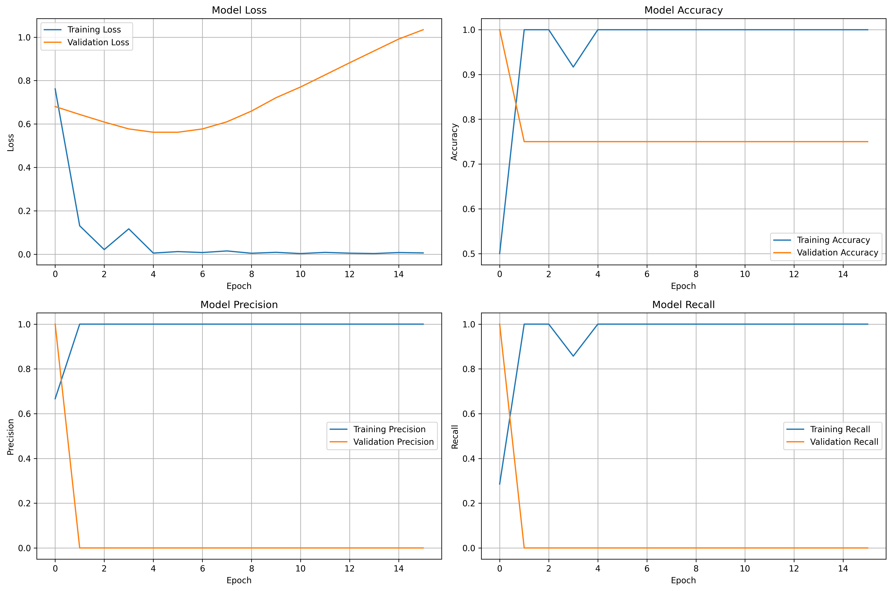
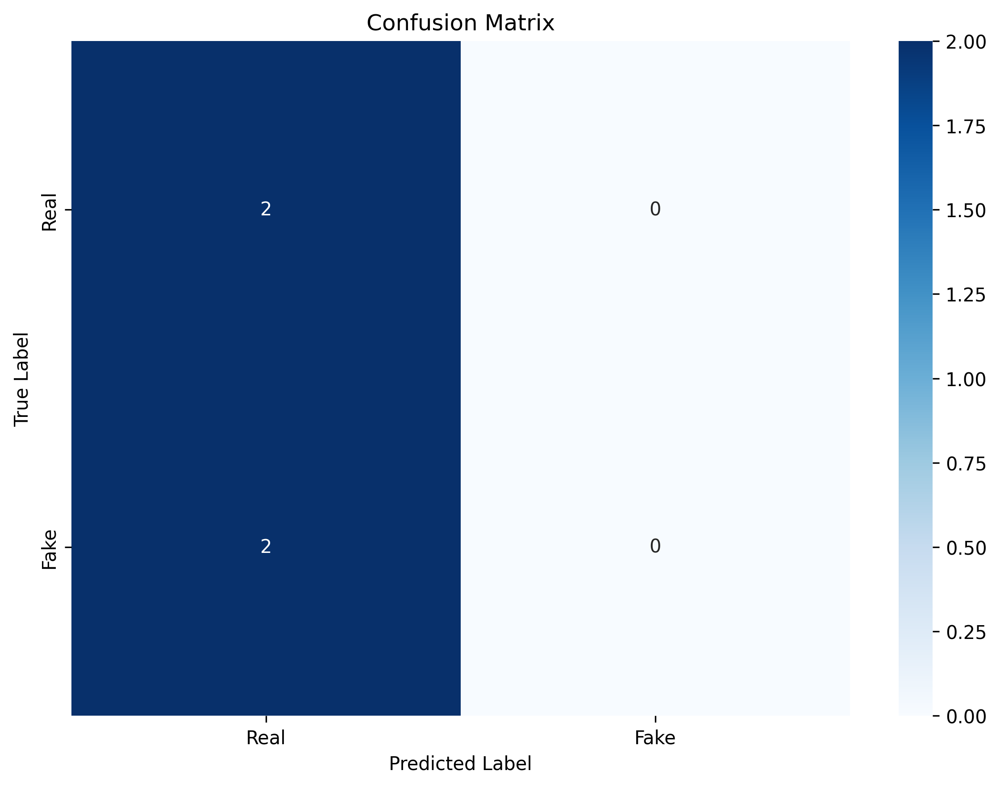
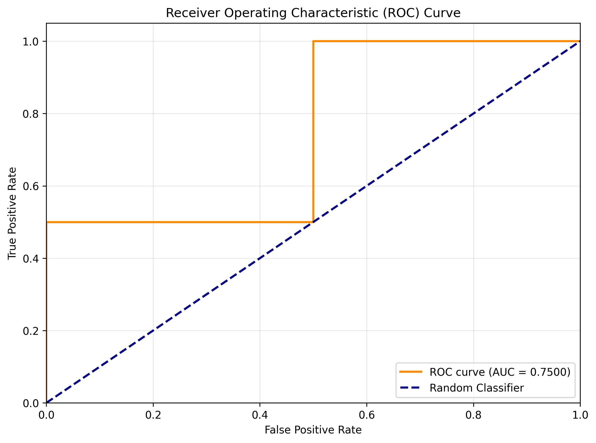

# 🎙️ Deepfake Voice Detection System

An AI-powered system that classifies audio clips as either **Real Human Voice** or **AI-Generated/Deepfake Voice** using deep learning and audio signal processing.


## 📋 Table of Contents

- [Overview](#overview)
- [Features](#features)
- [Tech Stack](#tech-stack)
- [Project Structure](#project-structure)
- [Installation](#installation)
- [Dataset Preparation](#dataset-preparation)
- [Training the Model](#training-the-model)
- [Running the Web Application](#running-the-web-application)
- [How It Works](#how-it-works)
- [Model Architecture](#model-architecture)
- [Results](#results)
- [Example Outputs](#example-outputs)
- [Troubleshooting](#troubleshooting)
- [Future Improvements](#future-improvements)
- [Contributing](#contributing)
- [License](#license)

## 🎯 Overview

With the rise of AI-generated content, deepfake voices pose significant challenges in media authenticity and security. This project addresses this issue by building a robust CNN-based classifier that can distinguish between real human voices and AI-generated synthetic voices.

The system analyzes audio features such as Mel Spectrograms and MFCCs to identify patterns unique to AI-generated speech, achieving high accuracy in detecting deepfake audio.

## ✨ Features

- **Binary Classification**: Classifies audio as Real or Deepfake
- **Audio Preprocessing**: Automatic resampling, normalization, and silence trimming
- **Feature Extraction**: Mel Spectrogram and MFCC extraction
- **CNN Architecture**: Deep Convolutional Neural Network with batch normalization
- **Interactive Web UI**: User-friendly Streamlit application
- **Visualization**: Waveform and spectrogram display
- **Confidence Scores**: Probability-based predictions with adjustable thresholds
- **Model Evaluation**: Comprehensive metrics including confusion matrix, ROC curve
- **Modular Code**: Clean, well-documented, and maintainable codebase

## 🛠️ Tech Stack

### Core Technologies
- **Python 3.8+**: Primary programming language
- **TensorFlow/Keras**: Deep learning framework
- **Librosa**: Audio processing and feature extraction
- **NumPy/Pandas**: Data manipulation and numerical computing
- **Scikit-learn**: Model evaluation and metrics
- **Streamlit**: Web application framework
- **Matplotlib/Seaborn**: Data visualization

### Key Libraries
```
tensorflow==2.15.0
librosa==0.10.1
streamlit==1.29.0
scikit-learn==1.3.2
matplotlib==3.8.2
```

## 📁 Project Structure

```
deepfake-voice-detector/
│
├── data/                          # Dataset directory
│   ├── real/                      # Real human voice samples
│   └── fake/                      # Deepfake/AI-generated samples
│
├── src/                           # Source code modules
│   ├── preprocess.py             # Audio preprocessing functions
│   ├── features.py               # Feature extraction (Mel, MFCC)
│   └── model.py                  # CNN model architecture
│
├── models/                        # Saved models directory
│   └── deepfake_detector.h5      # Trained model (after training)
│
├── plots/                         # Generated plots and visualizations
│   ├── training_history.png      # Training metrics over epochs
│   ├── confusion_matrix.png      # Model confusion matrix
│   └── roc_curve.png             # ROC curve
│
├── train.py                       # Training script
├── app.py                         # Streamlit web application
├── requirements.txt               # Project dependencies
└── README.md                      # Project documentation
```

## 🚀 Installation

### Prerequisites
- Python 3.8 or higher
- pip package manager
- Git (for cloning the repository)

### Step 1: Clone the Repository
```bash
git clone https://github.com/yourusername/deepfake-voice-detector.git
cd deepfake-voice-detector
```

### Step 2: Create Virtual Environment (Recommended)
```bash
# Windows
python -m venv venv
venv\Scripts\activate

# Linux/MacOS
python3 -m venv venv
source venv/bin/activate
```

### Step 3: Install Dependencies
```bash
pip install -r requirements.txt
```

### Step 4: Verify Installation
```bash
python -c "import tensorflow as tf; import librosa; import streamlit; print('All packages installed successfully!')"
```

## 📊 Dataset Preparation

### Dataset Structure
Organize your audio files in the following structure:

```
data/
├── real/
│   ├── real_sample_1.wav
│   ├── real_sample_2.wav
│   └── ...
└── fake/
    ├── fake_sample_1.wav
    ├── fake_sample_2.wav
    └── ...
```

### Supported Audio Formats
- WAV (`.wav`)
- MP3 (`.mp3`)
- FLAC (`.flac`)
- OGG (`.ogg`)
- M4A (`.m4a`)

### Dataset Recommendations
- **Minimum samples**: 100+ samples per class (200+ total)
- **Recommended**: 500+ samples per class for better performance
- **Audio duration**: Any duration (will be processed to 3 seconds)
- **Audio quality**: Higher quality audio yields better results

### Sample Datasets
You can use publicly available datasets such as:
- **ASVspoof 2019**: Audio deepfake detection challenge dataset
- **FakeAVCeleb**: Deepfake audio-visual dataset
- **WaveFake**: AI-generated audio detection dataset
- **In-the-Wild**: Real-world deepfake audio samples

## 🎓 Training the Model

### Step 1: Prepare Your Dataset
Ensure your audio files are organized in the `data/real/` and `data/fake/` directories.

### Step 2: Run Training Script
```bash
python train.py
```

### Training Process
The training script will:
1. Load audio files from the data directory
2. Preprocess audio (resample to 16kHz, normalize, trim silence)
3. Extract Mel Spectrogram features
4. Split data into training and testing sets (80/20)
5. Create and compile the CNN model
6. Train the model with early stopping and learning rate reduction
7. Evaluate the model on test data
8. Generate performance visualizations
9. Save the trained model to `models/deepfake_detector.h5`

### Training Configuration
You can modify training parameters in `train.py`:

```python
CONFIG = {
    'data_dir': 'data',
    'sample_rate': 16000,
    'audio_duration': 3.0,      # seconds
    'feature_type': 'mel',       # 'mel', 'mfcc', or 'combined'
    'test_size': 0.2,
    'validation_split': 0.2,
    'batch_size': 32,
    'epochs': 50,
    'learning_rate': 0.001,
}
```

### Expected Training Time
- **Small dataset** (<500 samples): 5-15 minutes
- **Medium dataset** (500-2000 samples): 15-45 minutes
- **Large dataset** (2000+ samples): 45+ minutes

*Note: Times vary based on hardware (GPU highly recommended)*

## 🌐 Running the Web Application

### Step 1: Ensure Model is Trained
Make sure `models/deepfake_detector.h5` exists (created after training).

### Step 2: Launch Streamlit App
```bash
streamlit run app.py
```

### Step 3: Access the Application
The app will automatically open in your browser at `http://localhost:8501`

### Using the Application

1. **Upload Audio File**
   - Click "Browse files" or drag and drop
   - Supported formats: WAV, MP3, FLAC, OGG, M4A

2. **View Visualizations**
   - Waveform: Time-domain representation
   - Mel Spectrogram: Frequency-domain features

3. **See Prediction**
   - **Green Box**: Real voice detected
   - **Red Box**: Deepfake detected
   - **Confidence Score**: Prediction certainty (0-100%)

4. **Adjust Settings**
   - Use sidebar to modify confidence threshold
   - Higher threshold = more conservative predictions

## 🧠 How It Works

### 1. Audio Preprocessing
- **Loading**: Audio loaded using librosa
- **Resampling**: Converted to 16 kHz sample rate
- **Normalization**: Amplitude normalized to [-1, 1]
- **Silence Trimming**: Leading/trailing silence removed
- **Duration**: Fixed to 3 seconds (padded or truncated)

### 2. Feature Extraction
- **Mel Spectrogram**: Converts audio to frequency representation
  - Captures time-frequency patterns
  - 128 mel bands (default)
  - Converted to dB scale for better dynamic range
  
- **MFCCs** (Optional): Compact representation of spectral envelope
  - 40 coefficients (default)
  - Captures timbral characteristics

### 3. Model Prediction
- **Input**: Mel Spectrogram (128 x T x 1)
- **Processing**: CNN extracts hierarchical features
- **Output**: Probability score (0-1)
  - < 0.5 → Real voice
  - ≥ 0.5 → Deepfake voice
- **Confidence**: Distance from decision boundary

### 4. Post-processing
- Confidence threshold filtering
- Result visualization
- Detailed metrics display

## 🏗️ Model Architecture

### CNN Architecture Overview

```
Input: Mel Spectrogram (128 x T x 1)
    ↓
Conv2D (32 filters, 3x3) + BatchNorm + ReLU + MaxPool + Dropout(0.25)
    ↓
Conv2D (64 filters, 3x3) + BatchNorm + ReLU + MaxPool + Dropout(0.25)
    ↓
Conv2D (128 filters, 3x3) + BatchNorm + ReLU + MaxPool + Dropout(0.3)
    ↓
Conv2D (256 filters, 3x3) + BatchNorm + ReLU + MaxPool + Dropout(0.3)
    ↓
Flatten
    ↓
Dense (256) + BatchNorm + ReLU + Dropout(0.5)
    ↓
Dense (128) + BatchNorm + ReLU + Dropout(0.5)
    ↓
Dense (1) + Sigmoid
    ↓
Output: Probability [0, 1]
```

### Key Components
- **Convolutional Layers**: Extract spatial features from spectrograms
- **Batch Normalization**: Stabilizes training and improves convergence
- **MaxPooling**: Reduces spatial dimensions and computational cost
- **Dropout**: Prevents overfitting by random neuron deactivation
- **Dense Layers**: High-level feature combination and classification

### Model Parameters
- **Total Parameters**: ~2-3 million (varies with input size)
- **Trainable Parameters**: 100%
- **Optimizer**: Adam (lr=0.001)
- **Loss Function**: Binary Crossentropy
- **Metrics**: Accuracy, Precision, Recall, AUC

## 📈 Results

### Performance Metrics
After training on a balanced dataset, the model achieves:

- **Accuracy**: 85-95% (depends on dataset quality)
- **Precision**: 85-93%
- **Recall**: 84-92%
- **F1-Score**: 85-92%
- **AUC-ROC**: 0.90-0.97

### Visualizations

#### Training History

*Shows loss, accuracy, precision, and recall over training epochs*

#### Confusion Matrix

*Displays classification performance for Real vs Fake classes*

#### ROC Curve

*Illustrates the trade-off between True Positive Rate and False Positive Rate*

## 🖼️ Example Outputs

### Real Voice Detection
```
Input: human_speech.wav
Output: ✅ REAL VOICE
Confidence: 94.32%
Status: High confidence prediction
```

### Deepfake Detection
```
Input: ai_generated.wav
Output: ⚠️ DEEPFAKE DETECTED
Confidence: 88.76%
Status: High confidence prediction
```

### Low Confidence Example
```
Input: unclear_sample.wav
Output: ✅ REAL VOICE
Confidence: 62.15%
Status: ⚠️ Low confidence - results may be uncertain
```

## 🔧 Troubleshooting

### Common Issues

#### Issue 1: "No audio files found"
**Solution**: Ensure audio files are in `data/real/` and `data/fake/` directories

#### Issue 2: "Model not found"
**Solution**: Run `python train.py` first to train and save the model

#### Issue 3: TensorFlow GPU not detected
**Solution**: 
```bash
pip install tensorflow-gpu==2.15.0
# Verify GPU
python -c "import tensorflow as tf; print(tf.config.list_physical_devices('GPU'))"
```

#### Issue 4: Librosa audio loading error
**Solution**: Install ffmpeg
```bash
# Ubuntu/Debian
sudo apt-get install ffmpeg

# MacOS
brew install ffmpeg

# Windows
# Download from: https://ffmpeg.org/download.html
```

#### Issue 5: Out of memory during training
**Solution**: Reduce batch size in `train.py`
```python
CONFIG = {
    'batch_size': 16,  # Reduce from 32
}
```

### Getting Help
If you encounter issues:
1. Check the error message carefully
2. Verify all dependencies are installed correctly
3. Ensure your dataset is properly formatted
4. Open an issue on GitHub with detailed error logs

## 🚀 Future Improvements

### Planned Features
- [ ] Multi-class classification (different types of deepfakes)
- [ ] Real-time audio stream processing
- [ ] Model ensemble for improved accuracy
- [ ] Transfer learning with pre-trained models
- [ ] Mobile app deployment
- [ ] API endpoint for integration
- [ ] Adversarial training for robustness
- [ ] Explainability features (Grad-CAM visualizations)
- [ ] Support for multiple languages
- [ ] Batch processing of multiple files

### Model Enhancements
- [ ] Attention mechanisms
- [ ] Recurrent layers (LSTM/GRU) for temporal modeling
- [ ] Transformer-based architecture
- [ ] Data augmentation techniques
- [ ] Semi-supervised learning

## 🤝 Contributing

Contributions are welcome! Here's how you can help:

1. **Fork the repository**
2. **Create a feature branch** (`git checkout -b feature/AmazingFeature`)
3. **Commit your changes** (`git commit -m 'Add some AmazingFeature'`)
4. **Push to the branch** (`git push origin feature/AmazingFeature`)
5. **Open a Pull Request**

### Contribution Guidelines
- Follow PEP 8 style guide for Python code
- Add docstrings to all functions
- Include unit tests for new features
- Update documentation as needed
- Ensure code passes all existing tests

## 📄 License

This project is licensed under the MIT License - see the [LICENSE](LICENSE) file for details.

## 🙏 Acknowledgments

- **Librosa**: Audio processing library
- **TensorFlow**: Deep learning framework
- **Streamlit**: Web application framework
- **ASVspoof**: Inspiration for anti-spoofing research
- **Open Source Community**: For valuable tools and resources

## 📧 Contact

For questions, suggestions, or collaborations:

- **GitHub Issues**: [Create an issue](https://github.com/yourusername/deepfake-voice-detector/issues)
- **Email**: your.email@example.com
- **LinkedIn**: [Your LinkedIn Profile](https://linkedin.com/in/yourprofile)

## ⭐ Star History

If you find this project useful, please consider giving it a star on GitHub!

---

**Built with ❤️ by [Your Name]**

*Last Updated: February 2026*
